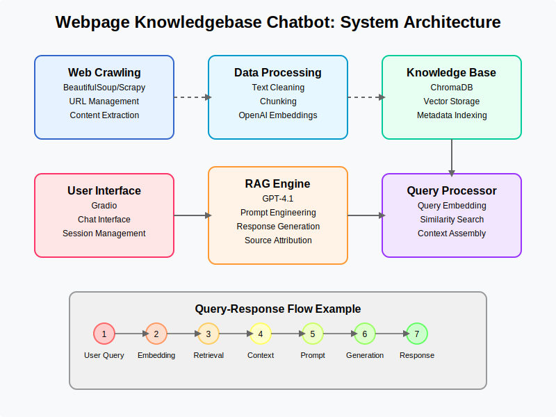

# Manzil Help Center Chatbot

A Retrieval-Augmented Generation (RAG) system designed to provide accurate, contextually relevant information about Manzil's Shariah-compliant financial services by extracting and understanding content from the Manzil Help Center website.



## Overview

Manzil is a Canadian financial services company dedicated to providing Shariah-compliant solutions tailored for the Muslim community. This chatbot helps users find information about Manzil's services, including:

- Halal Home Financing (Murabaha mortgage)
- Halal Investing & Wealth Management
- Islamic Wills (Wasiyyah)
- Halal Prepaid MasterCard
- Manzil Communities (residential projects)
- Zakat Calculation
- Financial Education

The chatbot uses a RAG (Retrieval-Augmented Generation) architecture to ensure responses are grounded in accurate information extracted from Manzil's help center.

## Features

- **Web Crawling**: Extracts content from Manzil's help center website with politeness policies
- **Semantic Understanding**: Processes and chunks content based on document structure
- **Vector Embeddings**: Creates searchable vector representations of content
- **Contextual Retrieval**: Finds the most relevant information based on user queries
- **Islamic Finance Focus**: Tailored for Shariah-compliant financial terminology and concepts
- **Source Attribution**: Provides references to where information was found
- **Conversation History**: Maintains context across multiple interactions
- **Entity Tracking**: Understands relationships between financial products, terms, and concepts

## System Architecture

The system follows a modular architecture with clear separation of concerns:


1. **Content Extraction & Processing**

   - Web crawler extracts and cleans content from the help center
   - Content is semantically chunked and organized
   - Domain-specific relevance scoring applied

2. **Knowledge Base**

   - Vector database (ChromaDB) for similarity search
   - Optional knowledge graph for entity relationships
   - Hierarchical content structure

3. **Query Processing**

   - Query classification and enhancement
   - Entity extraction
   - Intent recognition

4. **RAG Pipeline**

   - Context retrieval based on semantic similarity
   - Response generation with source attribution
   - Prompt engineering tailored to financial queries

5. **User Interface**
   - Gradio-based chat interface
   - Example questions
   - Mobile-responsive design

## Installation

### Prerequisites

- Python 3.10+
- OpenAI API key
- Internet connection for web crawling

### Setup

1. Clone the repository:

   ```bash
   git clone https://github.com/yourusername/manzil-chatbot.git
   cd manzil-chatbot
   ```

2. Create and activate a virtual environment:

   ```bash
   python -m venv venv
   source venv/bin/activate  # On Windows: venv\Scripts\activate
   ```

3. Install dependencies:

   ```bash
   pip install -r requirements.txt
   ```

4. Create a `.env` file with your configuration:

   ```bash
   OPENAI_API_KEY=your_openai_api_key
   BASE_URL=https://help.manzil.ca/hc/en-us
   DEBUG_MODE=False
   ```

## Usage

### Initialize the Knowledge Base

Before first use, you need to initialize the knowledge base by crawling the Manzil Help Center:

```bash
python main.py --initialize-only
```

This will crawl the website, process the content, and store it in the vector database. This only needs to be done once, or when you want to refresh the knowledge base with updated content.

### Start the Chatbot

To start the chatbot with the web interface:

```bash
python main.py
```

This will launch the Gradio interface, accessible at [http://localhost:7860](http://localhost:7860) by default.

### Command-line Options

- `--refresh`: Force refresh of the knowledge base
- `--initialize-only`: Only initialize the knowledge base, then exit
- `--debug`: Run in debug mode with more detailed logging

## Configuration

All configuration options can be set in the `.env` file or as environment variables:

| Option                   | Description             | Default                           |
| ------------------------ | ----------------------- | --------------------------------- |
| `OPENAI_API_KEY`         | Your OpenAI API key     | (Required)                        |
| `BASE_URL`               | URL of the help center  | `https://help.manzil.ca/hc/en-us` |
| `MAX_PAGES`              | Maximum pages to crawl  | 100                               |
| `CHUNK_SIZE`             | Size of text chunks     | 500                               |
| `CHUNK_OVERLAP`          | Overlap between chunks  | 100                               |
| `EMBEDDING_MODEL`        | OpenAI embedding model  | `text-embedding-3-large`          |
| `COMPLETION_MODEL`       | OpenAI completion model | `gpt-4.1`                          |
| `DEBUG_MODE`             | Enable debug logging    | `False`                           |
| `ENABLE_KNOWLEDGE_GRAPH` | Enable entity tracking  | `False`                           |
| `SERVER_PORT`            | Web interface port      | 7860                              |

## Project Structure

```bash
manzil-chatbot/
├── config/
│   ├── __init__.py
│   └── settings.py              # Configuration settings
├── crawler/
│   ├── __init__.py
│   ├── crawler.py               # Web crawling module
│   └── content_extractor.py     # HTML content extraction
├── knowledge_base/
│   ├── __init__.py
│   ├── vector_store.py          # ChromaDB operations
│   ├── knowledge_graph.py       # Entity tracking
│   └── chunking.py              # Text chunking strategies
├── nlp/
│   ├── __init__.py
│   ├── embeddings.py            # Embedding generation
│   ├── query_processor.py       # Query classification
│   └── prompt_engineering.py    # Prompt templates
├── rag/
│   ├── __init__.py
│   ├── retriever.py             # Context retrieval
│   └── generator.py             # Response generation
├── ui/
│   ├── __init__.py
│   └── gradio_app.py            # Gradio user interface
├── utils/
│   ├── __init__.py
│   ├── logging_config.py        # Logging configuration
│   ├── error_handlers.py        # Custom exceptions
│   └── rate_limiters.py         # API rate limiting
├── __init__.py
├── main.py                      # Application entry point
├── requirements.txt             # Project dependencies
└── README.md                    # This file
```

## Customization

### Adding New Sources

To add new content sources:

1. Modify `config/settings.py` to update the `BASE_URL`
2. Run `python main.py --refresh` to re-crawl the website

### Tuning Response Generation

Adjust prompt templates in `nlp/prompt_engineering.py` to modify how responses are generated.

### Extending Entity Recognition

Update the Islamic finance terminology and entity types in `knowledge_base/knowledge_graph.py` and `nlp/query_processor.py`.

## Development

### Code Style

This project follows PEP 8 style guidelines. Run linting with:

```bash
flake8 .
```

### Adding New Components

1. Create a new module in the appropriate directory
2. Update `main.py` to incorporate the new component
3. Add any required dependencies to `requirements.txt`

## Troubleshooting

### Common Issues

- **OpenAI API Rate Limits**: Adjust rate limiting parameters in `utils/rate_limiters.py`
- **Crawling Errors**: Check `logs/` directory for detailed error messages
- **Memory Issues**: Reduce `MAX_PAGES` or `EMBEDDING_BATCH_SIZE` in `.env`

### Logs

Logs are stored in the `logs/` directory with timestamps. In case of issues, check these logs for detailed error messages.

## License

This project is licensed under the MIT License - see the LICENSE file for details.

## Acknowledgments

- Manzil for providing Shariah-compliant financial services
- OpenAI for providing the foundation models
- Gradio for the user interface framework
- ChromaDB for vector storage capabilities
